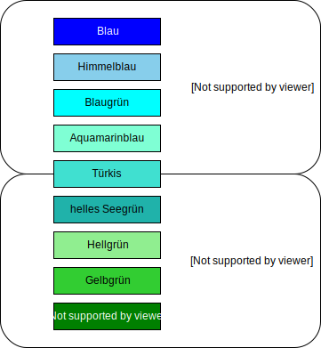

Diese Einstellung ist für Sie relevant, wenn Sie Ihre Artikel mit Eigenschaften (Attributen) ausgerüstet haben und Sie diese den Shopbesuchern zur Filterung anbieten.

Häufig gibt es Produkte, die unterschiedliche Eigenschaften mit der selben oder sehr ähnlichen Bedeutung haben. Das passiert typischerweise bei Kleidergrößen aus unterschiedlichen Regionen oder auch bei fein differenzierten Farbangaben. Bieten Sie zum Beispiel Produkte in den Farben "Lachs", "Koralle" und "helles Korallenrot" an, müsste sich Ihr Shopbesucher zwischen diesen Nuancen entscheiden oder alle ähnlichen Farben wählen. Hierbei können Sie ihm mit den korrespondierenden Attributwerten helfen. 

Durch Verküpfung der einzelnen Angaben miteinander erzeugen Sie Wertegruppen. Sobald der Besucher einen dieser Werte wählt, werden im Hintergrund automatisch alle anderen Werte der selben Gruppe ebenfalls ausgewählt. 
Natürlich können Sie einen Wert auch mehreren Gruppen zuordnen (z.B. "Türkis" zur Gruppe "Blau" und auch zur Gruppe "Grün"). So wird "Türkis" zusätzlich mit gewählt, wenn Ihr Besucher blau oder auch grün gewählt hat.

Um solche Wertegruppen einzurichten, gehen Sie bitte so vor:
1. setzen Sie im Admin am betreffenden Attribut die Option [ fügt korrespondierende Attributwerte hinzu ]
2. gehen Sie zum Synonymeditor unter [ D3 Module ] -> [ erweiterte Suche ] -> [ Synonym-Editor ], tragen Sie dort den ersten Attributswert ein und aktivieren die Verwendung für die korrespondierenden Attributwerte. Speichern Sie die Einstellungen.
3. wechseln Sie in den Tab [ Synonyme bearbeiten ] und tragen dort alle dazu passenden Werte ein.

Für eine zusätzliche Wertegruppe führen Sie die Schritte 2 und 3 erneut aus. Beachten Sie bitte, dass die Synonymbezeichnung genau dem am Artikel hinterlegten Attributswert entsprechen muss (Groß-/Kleinschreibung wird nicht berücksichtigt).
